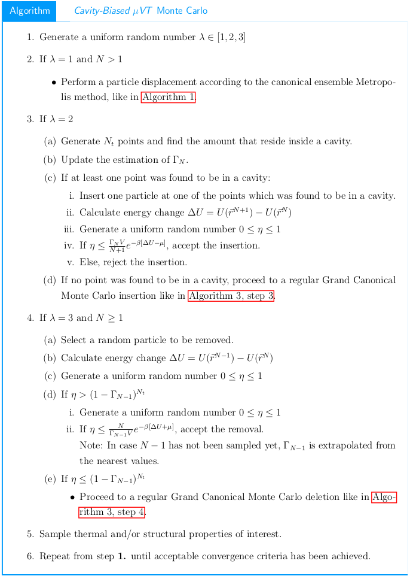
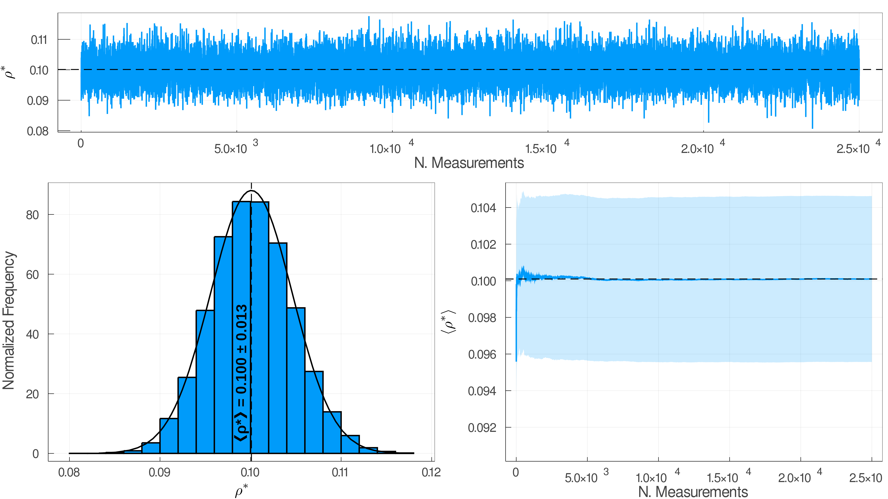

# Cavity-Biased Markov Chain Monte Carlo for the Grand Canonical Ensemble

Semi-interactive code for fluid simulations in the μVT ensemble according to Mezei's Cavity-Biased algorithm, which improves insertions in high-density systems.

The environment consists of a fixed-size simulation box centered in the origin, filled with spherical molecules based on the density of the system. Their interaction is according to either a Lennard-Jones or Square-Well potential (implementation of additional potentials is straightforward) in the reduced unit's system.

New states are generated either by insertion, removal or displacement of molecules, according to the probabilities in the upcoming scheme:

Code has been designed with succesful parameters as compared with official reported results. This includes a 20σ ✕ 20σ ✕ 20σ simulation box with 2 ✕ ⌈ 0.5 ✕ V ⌉ ✕ 10E4 relaxation steps and 2.5 ✕ ⌈ 0.5 ✕ V ⌉ ✕ 10E5 equilibrium steps, for a total of 25,000 samples.

Execution is straightforward by parsing arguments:

    julia GrandCanonical.jl -h
    usage: GrandCanonical.jl [-h] μ T

    positional arguments:
        μ           Chemical Potental (type: Float64)
        T           Temperature (type: Float64)

    optional arguments:
        -h, --help  show this help message and exit

This generates output files with the energy, density and radial distribution function evolution of the system along the simulation, as well as their corresponding plots.

